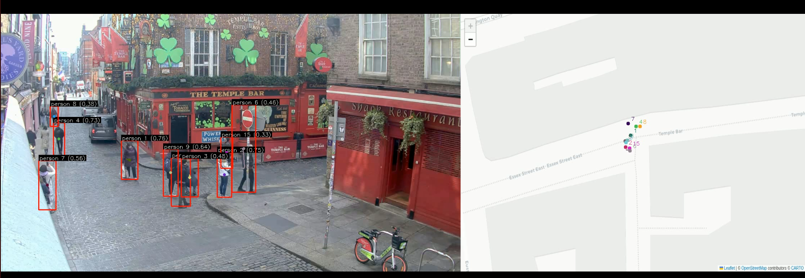

# Spatial Object Tracking



A lightweight Python project for object tracking and map visualization using YOLOv8 and GPS/map overlays.

This repository includes:

- `yolo_track_gps.py` - video-based object detection and multi-object tracking with YOLOv8 and ByteTrack.
- `saveGpsMap.py` - generates a map image from GPS coordinates using Folium and Selenium.
- `inputs/` - expected input files such as video, GPS trajectory CSV, and other assets.
- `outputs/` - generated map images, HTML map previews, and tracked video output.

## What this project does

- Detects moving objects in video frames using `ultralytics.YOLO`.
- Tracks object IDs across frames with ByteTrack.
- Draws bounding boxes, track IDs, score labels, and motion trails on video.
- Projects detected object positions onto a map overlay (`outputs/saveGpsMap.png`).
- Supports single-camera analytics for people tracking, vehicle tracking, and location visualization.

## Key use cases

- **People tracking**: identify and follow pedestrians in video feeds for crowd analytics, queue monitoring, and safety.
- **Vehicle tracking**: monitor cars, bikes, and fleets in parking lots, streets, and transit hubs.
- **Location analytics**: visualize estimated object movement on a geographic map or custom site plan.
- **Locator / asset monitoring**: combine image detections with GPS-style map plotting for asset awareness and route validation.

## Requirements

- Python 3.8+
- `opencv-python`
- `numpy`
- `Pillow`
- `ultralytics`
- `folium`
- `selenium`
- a compatible Chrome/Chromium browser and ChromeDriver for `saveGpsMap.py`

Install dependencies with pip:

```bash
pip install opencv-python numpy pillow ultralytics folium selenium
```

## Setup

1. Place your input video in `inputs/`.
2. If using GPS/object location CSV data, place it in `inputs/object_locations.csv`.
3. Update the model path in `yolo_track_gps.py` to a valid YOLOv8 weights file, for example:
   - `/home/bharath/Downloads/test_codes/models/yolov8n.pt`
4. Ensure `outputs/` exists (the repo already creates it in `saveGpsMap.py`).
5. Ensure `saveGpsMap.py` can run with ChromeDriver available on your `PATH`.

## Running the code

### Generate the map image

```bash
python saveGpsMap.py
```

This generates:

- `outputs/saveGpsMap.html` - interactive Folium map HTML.
- `outputs/saveGpsMap.png` - screenshot of the map used by the tracking script.

### Run video tracking and map overlay

```bash
python yolo_track_gps.py
```

This script:

- loads the video from `inputs/youtube_stream_20250321_151616.mp4`
- runs YOLO detection and object tracking
- draws on video frames and map overlay
- writes output to `outputs/tracked_<original-video-name>`

## How it works

- `process_frame()` performs detection + tracking via `model.track(...)`.
- `draw_annotations()` draws bounding boxes, ID labels, and motion trails.
- `plot_detected_on_map()` projects detected object centers onto the saved map image using scaling and rotation.
- `load_object_locations()` loads input GPS-style object positioning from CSV for map plotting.

## Customization

- Change `model.overrides` in `yolo_track_gps.py` to adjust confidence, IoU, and object classes.
- Update `scale`, `rotation`, `offset_x`, and `offset_y` to align the projected track overlay with your map.
- Swap the video path and input CSV path to your own dataset.
- Extend the object class filters to detect people, cars, bikes, or any supported YOLO classes.

## Notes for analytics

- Use pedestrian class output for people counting and movement heatmaps.
- Use vehicle class output for traffic monitoring, parking analytics, and fleet tracking.
- Use the map overlay to support geo-aware analytics and to compare live detections with known GPS tracks.
- This repo is a good starting point for edge analytics, site safety, and smart city monitoring.

## File summary

- `yolo_track_gps.py` - main tracking and annotation engine.
- `saveGpsMap.py` - map image generation from Folium HTML.
- `inputs/` - store your video, GPS CSV, and other input files.
- `outputs/` - receives map screenshots and tracked output video.

## Next steps

- Add configurable command-line arguments for input/output paths.
- Support runtime selection of detection classes (`people`, `vehicles`).
- Add a dashboard or CSV export for analytics metrics like counts, dwell time, and path lengths.
